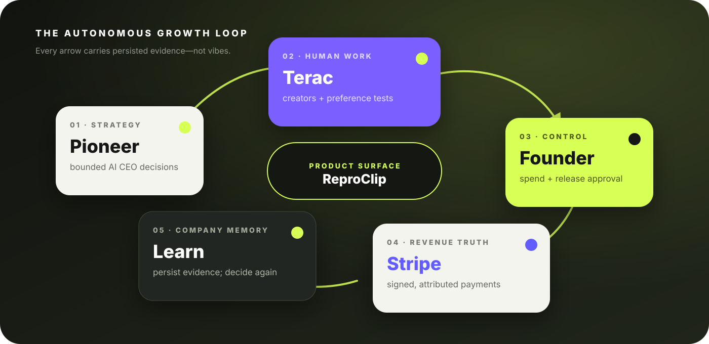
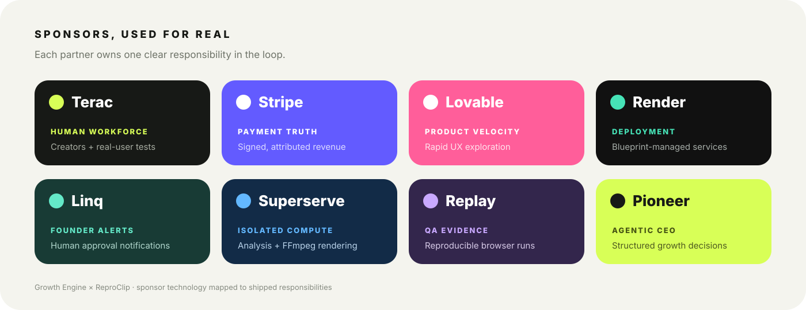

<div align="center">

# Growth Engine

### The autonomous company behind [ReproClip](https://github.com/KaushikSiva/repro-clip)

**AI strategy → real human work → founder approval → distribution → verified revenue → a smarter next decision.**

[](https://github.com/KaushikSiva/growth-engine/stargazers)
[](https://github.com/KaushikSiva/repro-clip)
[](https://render.com/)
[](./backend)
[](./web)

<br />



</div>

## The idea

ReproClip can record a workflow and turn it into a focused product demo. Growth Engine answers the harder question: **can the product learn how to grow itself without pretending that AI can replace judgment, customers, or payment truth?**

This repository contains the project's major operating system. It gives ReproClip an AI CEO, an on-demand human workforce, approval gates around money, campaign and referral memory, real revenue attribution, and a founder console that refuses to manufacture success.

```text
Pioneer decides what to try
        ↓
Terac recruits creators and tests work with real people
        ↓
The founder approves financial actions and creative releases
        ↓
ReproClip distributes attributed links and accepts support
        ↓
Stripe proves what was actually paid
        ↓
Growth Engine persists the evidence and Pioneer decides again
```

There are **zero marketing employees**, no seeded revenue, no invented engagement, and no automatic creator payout approval.

## Sponsors became infrastructure

<p align="center">
  
</p>

These tools are part of the product story, not a logo wall:

| Sponsor | How we used it | Where the evidence lives |
| --- | --- | --- |
| **[Pioneer](https://pioneer.ai/)** | Runs the bounded AI CEO. It receives persisted business state and returns a schema-validated growth decision, budget, campaign hypothesis, and next actions using open-weight inference. | [`backend/app/services/pioneer.py`](backend/app/services/pioneer.py) |
| **[Terac](https://terac.com/mcp)** | Gives the AI company a real human supply layer. Growth Engine discovers Terac MCP tools, requests priced creator or research work, launches only after founder approval, and synchronizes verified submissions. | [`backend/app/services/terac.py`](backend/app/services/terac.py) |
| **[Stripe](https://stripe.com/)** | Provides payment truth. ReproClip owns Checkout and signature-verified webhooks; Growth Engine reads the shared, persisted payments to calculate conversion, CAC, ROAS, and contribution. It never treats a click as revenue. | [`backend/app/services/metrics.py`](backend/app/services/metrics.py) and [ReproClip payments](https://github.com/KaushikSiva/repro-clip/tree/main/app/api/stripe) |
| **[Linq](https://www.linqapp.com/)** | Closes the founder-review loop with direct phone notifications when a submission needs a human decision. AI can recommend; the message brings the accountable person back into the workflow. | [`backend/app/services/linq.py`](backend/app/services/linq.py) |
| **[Render](https://render.com/)** | Hosts the FastAPI control plane and Next.js company console as a two-service Blueprint, runs database migrations before release, and keeps configuration in infrastructure-as-code. | [`render.yaml`](render.yaml) |
| **[Replay](https://www.replay.io/)** | Captures reproducible browser-debugging evidence. Growth Engine stores the real Replay run URL and its explicit pass/fail checks so QA status is auditable instead of inferred. | [`POST /api/company/qa/replay`](backend/app/routers/company.py) |
| **[Superserve](https://www.superserve.ai/)** | Supplies isolated compute for ReproClip's media pipeline. Auto Edit creates a sandbox, analyzes interaction signals, runs FFmpeg, and returns the rendered artifact; Growth Engine receives the product outcomes rather than doing video work itself. | [ReproClip Superserve integration](https://github.com/KaushikSiva/repro-clip/blob/main/lib/superserve.ts) |
| **[Lovable](https://lovable.dev/)** | Accelerated early product and interface exploration for the customer-facing experience. Those rapid prototypes helped shape the workflow that Growth Engine now measures and improves with real signals. | Product-design phase; production implementation lives in [ReproClip](https://github.com/KaushikSiva/repro-clip) |

## One loop, real state

Growth Engine does not let model output masquerade as company progress. Each stage advances only when the corresponding external event has been persisted.

1. **Decide.** Pioneer sees real metrics, Terac feedback, current spend, and prior decisions. Its JSON must pass a strict Pydantic schema and stay within the configured budget.
2. **Commission.** Terac receives a concrete creator or general-population research brief and returns a real feasibility request and price.
3. **Approve.** A founder token is required before spend launches and before creator work is accepted or rejected.
4. **Distribute.** Each campaign and creator gets an attributed `/r/<code>` link; visits are stored rather than estimated.
5. **Verify.** ReproClip's Stripe webhook writes only signed payment events into the shared database.
6. **Learn.** Campaign economics and human preference results become the next Pioneer input snapshot.

## What you can see

The Next.js operations console exposes the company as it really is:

- a live Pioneer CEO decision and its bounded rationale;
- campaigns tied to Terac jobs, creators, and human studies;
- individual creator submissions with explicit founder review;
- attributed visits, supporters, revenue, spend, CAC, ROAS, and contribution;
- a live activity stream backed by persisted events;
- a judge/demo view whose checkpoints remain visibly incomplete until real events exist.

## Architecture

| Layer | Technology | Responsibility |
| --- | --- | --- |
| Company console | Next.js, React, Tailwind CSS | Decisions, campaigns, submissions, economics, demo state |
| Control plane | FastAPI, Pydantic, SQLAlchemy | Guarded workflows, schemas, integrations, event recording |
| Business memory | Supabase Postgres, Alembic | Campaigns, studies, creators, referrals, visits, payments, decisions |
| AI executive | Pioneer | Structured strategy from persisted state |
| Human workforce | Terac MCP | Creators, feedback panels, feasibility, verified results |
| Revenue truth | Stripe via ReproClip | Checkout, signed webhooks, attributed support payments |
| Founder channel | Linq | Review and approval notifications |
| QA evidence | Replay | Reproducible browser runs and explicit checks |
| Media compute | Superserve via ReproClip | Isolated analysis and FFmpeg rendering |
| Deployment | Render Blueprint | FastAPI and Next.js services with pre-deploy migrations |

## Safety is a feature

- **No fake traction.** Human, social, and financial metrics remain zero or unavailable until real results are persisted.
- **No model-controlled money.** `FOUNDER_APPROVAL_TOKEN` gates spend and submission decisions.
- **No unverified revenue.** Only Stripe webhook-verified payments count.
- **No imaginary integrations.** Missing credentials keep an integration explicitly unavailable.
- **No hidden chain of thought.** Pioneer stores a concise business rationale, not private reasoning traces.
- **No browser database secrets.** Supabase credentials stay inside the FastAPI service.

## Run it locally

```bash
cp .env.example .env

cd backend
python3 -m venv .venv
.venv/bin/pip install -r requirements.txt
.venv/bin/alembic upgrade head
.venv/bin/uvicorn app.main:app --reload

# In another terminal
cd web
npm install
npm run dev
```

Open `http://localhost:3001/company`. The API runs at `http://localhost:8000`. Without `SUPABASE_DATABASE_URL`, local development deliberately uses SQLite.

<details>
<summary><strong>Production configuration</strong></summary>

Create a Render Blueprint from [`render.yaml`](render.yaml). Use Supabase's Session pooler URL on port `5432` for the API's `SUPABASE_DATABASE_URL`, then configure:

- `SUPABASE_MIGRATION_URL`
- `APP_BASE_URL`, `PRODUCT_BASE_URL`, and `CORS_ORIGINS`
- `NEXT_PUBLIC_API_URL` and `COMPANY_API_URL`
- `PIONEER_API_KEY` and `PIONEER_MODEL`
- `TERAC_API_KEY`, `TERAC_MCP_URL`, and a nonzero `TERAC_BUDGET_USD`
- optional Linq and Replay variables

Stripe secrets remain on ReproClip. Both services point to the same Supabase database so verified payment and attribution events become Growth Engine signals.

</details>

## Verify the system

```bash
cd backend && .venv/bin/pytest -q
cd web && npm run typecheck && npm run lint && npm run build
```

The tests prove that zero-state metrics stay honest, a persisted Stripe payment changes company revenue, Pioneer cannot return an unknown or unbounded decision, and creator work remains pending until explicit founder review.

## Repository map

```text
growth-engine/
├── backend/
│   ├── app/services/       # Pioneer, Terac, Linq, metrics
│   ├── app/routers/        # company, campaigns, referrals
│   ├── alembic/            # production schema history
│   └── tests/              # honest company-loop tests
├── web/
│   ├── app/company/        # operating console
│   └── app/demo/           # real-state judge flow
├── render.yaml             # two-service deployment
└── .env.example            # configuration contract
```

## Follow the experiment

This is an experiment in giving an open-source product a measurable, human-grounded growth loop—not replacing every person with a prompt.

If that is a future you want to explore, **[star Growth Engine](https://github.com/KaushikSiva/growth-engine)**, try [ReproClip](https://github.com/KaushikSiva/repro-clip), and open an issue with the first part of the loop you would improve.

<div align="center">

**Built around real people, real payments, and real evidence.**

</div>
